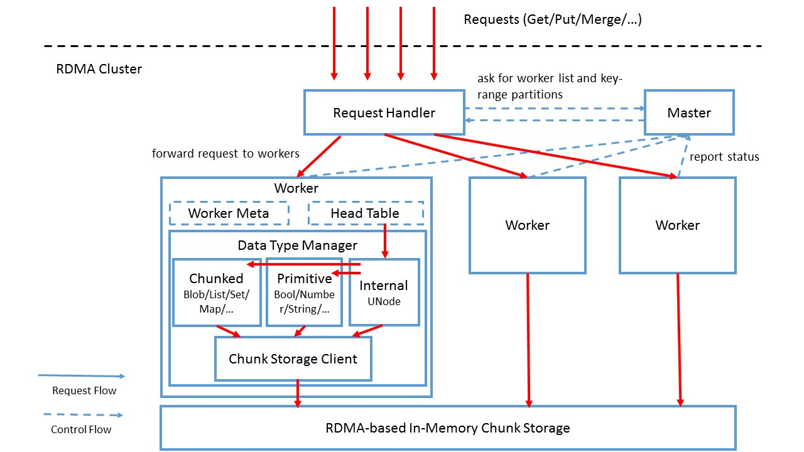

### Request Handler
All user requests will be collected/queued by Request Handler.
In other to send request to worker nodes, it need first fetch worker list and key-range assignment from Master.
It will cache Worker list, unless it detect the cache is out of date, and then re-fetch it from Master.
To forward a request, it need to first retrieve the corresponding Worker that manages that key range.

### Master
Master monitors all Workers in the cluster.
It is also responsible for assigning/re-assigning key ranges to Workers.
If a Worker fails, the Master need to re-assign the key-range to aother Worker.

### Worker
Worker handles requests forwared from Request Handler.
It maintains a table containing the current head version of each (key, branch).
Upon receive a request, it first retrieves the target version from head table (if necessary).
It then load corresponding UNode from Data Type Manager.
From the UNode, it might also load other embeded data types (string, blob, etc...).
It operate updates on the data and create a new UNode for update.
It keep the head table update-to-date after each update.

### Data Type Manager
Data Type Manager hides the Chunk Storage and internal data type representation from Worker logics.
When load an object, it will first load corresponding data chunk from Chunk Storage, and de-serialize it.
Data types may support different operations.
after all update operations are done, the object will finalize its own chunk organization (Prolly Tree).
When finally commit the object, it will write only new chunks to Chunk Storage.

### Chunk Storage
Chunk Storage is a distributed storage across the whole cluster.
It handles all read/write chunk requests from Data Types.
The storage will prefer to write new chunks in local node, unless the node is over-loaded already.
