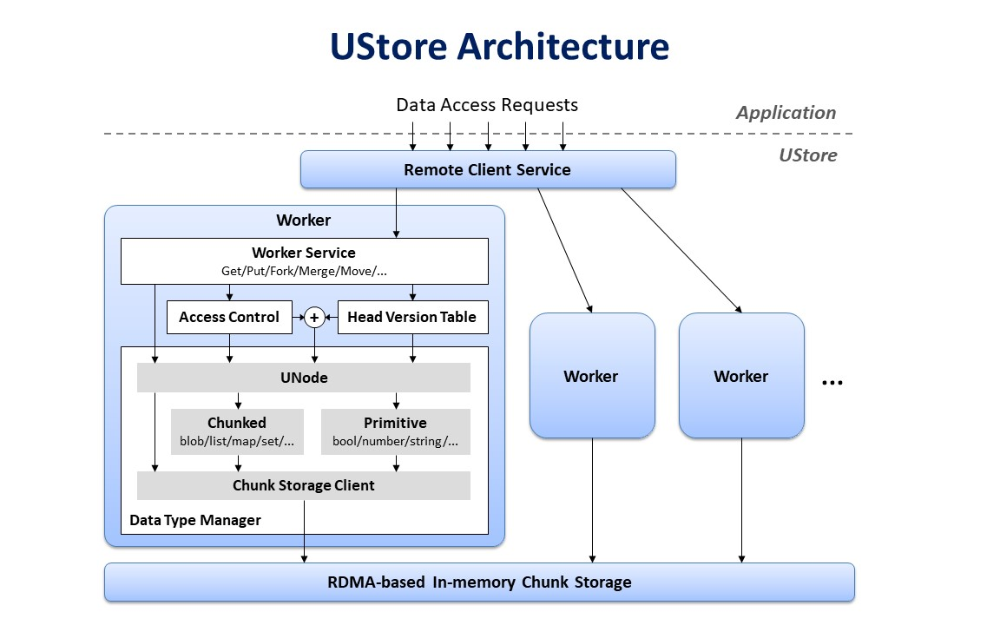

# System Architecture

## Remote Client Service
``Remote Client Service`` receives all requests from application,
and forwards the requests to the corresponding workers to process.
The requests are dispatched based on the hash value of the request key.

## Worker
``Worker``s process requests from disjoint subsets of keys.

## Worker Service
``Worker Service`` receives requests from the client service and translates the request messages
to the corresponding data structures.

## Access Control
``Access Control`` checks the permission of each request before it is further processed.
Unauthorized requests will be rejected directly.

## Head Version Table
``Head Version Table`` maintains the up-to-date head information for all named and unnamed branches.
Each update of a branch head is captured in the table and persisted on disk.

## Data Type Manager
``Data Type Manager`` hides chunk storage and internal data representation from worker logics.
When loading an object, it loads the corresponding data chunks and de-serializes them.
After an update operation is done, the object will be chunked and only new chunks are written back to chunk storage.

## Chunk Storage
``Chunk Storage`` is distributed across the cluster. It handles read/write chunk requests from the data type manager.
